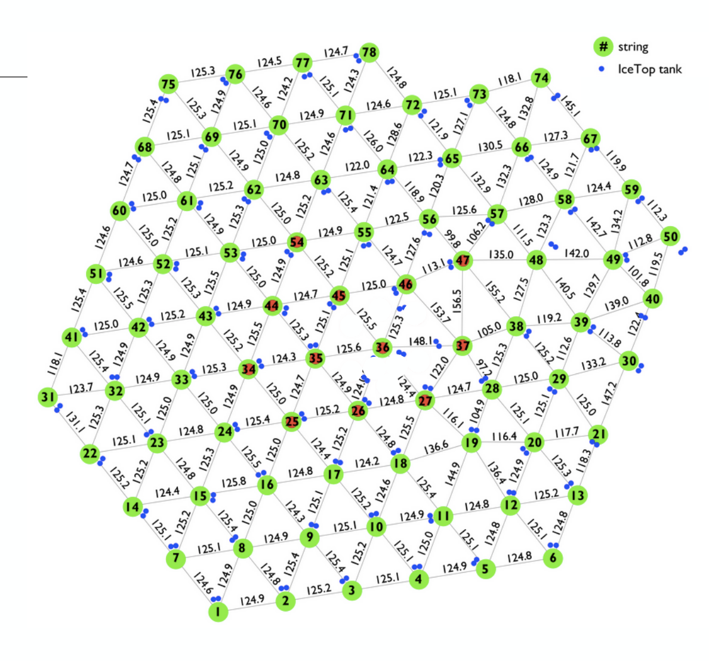

# Graph Neural Networks for IceCube Low-Energy Signal Classification and Regression

A PyTorch implementation of an attention-based graph neural network (GNN, also GAN - graph attention network) for neutrino event identification and reconstruction in the [IceCube Neutrino Observatory](https://icecube.wisc.edu/), based on the architecture described in [Choma et al. (2018)](https://arxiv.org/abs/1809.06166) and [Monti et al. (2016)](https://arxiv.org/abs/1611.08402), utilizing attention mechanism described in [Veličković et al. (2017)](https://arxiv.org/abs/1710.10903)

## Overview

IceCube is a cubic-kilometer neutrino detector buried in the Antarctic ice, consisting of 5160 digital optical modules (DOMs - Cherenkov light sensors) arranged on 86 vertical strings in an relatively regular hexagonal grid, which included a more densely populated sub-array central region named DeepCore. The primary goal for this network is to separate rare neutrino-induced muon events (signal) from the overwhelming background of cosmic-ray muon bundles, which require rejection rates on the order of 10⁻⁶.



Contemporary machine learning reconstruction/identification methods involved [ResNet](https://arxiv.org/abs/1512.03385) convolutional neural network (CNN) ([Mirco et. al (2018)](https://pos.sissa.it/301/1057)), which assumes shift-invariance. This assumption is too strong for IceCube:
- The detector geometry is irregular and non-Euclidean (hexagonal grid with variable spacing)
- Events activate only a sparse subset of sensors, in addition to many dead sensors
- Mapping the detector onto a rectangular grid introduces artifacts and additional complexities (filters, layers, etc.) that's prone to overfitting
A graph neural network addresses these issues by modeling events in the detector as densely connected graphs, with nodes consisting of only sensors activated during the event, and edges representing pairwise distance between sensors calculated using a learned Gaussian kernel function.

## Architecture

---
Input (per event):
  └─ Variable-size point cloud of active DOMs
     Each DOM: [x, y, z, charge_first, charge_total, time_first, nstring]

Graph construction:
  └─ Learnable Gaussian kernel over sensor spatial coordinates
     $A_{ij} = \text{softmax}(\exp(-||\mathbf{x}_i - \mathbf{x}_j||² / σ²))$
     σ is a learned parameter controlling locality

Convolution layers:
  └─ Graph convolution operation: $\text{GConv}(\mathbf{X}) = [\mathbf{AX}, \mathbf{X}] \cdot \mathbf{a}^T + b \cdot \mathbf{1}$
  └─ Output (of layer $t$): $\mathbf{X}^{t+1} = [\text{ReLU}(\text{GConv}(\mathbf{X}^t)), \text{GConv}(\mathbf{X})]$  (concatenated residual)
  └─ Batch normalization with padding-aware mean/variance

Readout:
  └─ Sum pooling over all active nodes
  └─ Instance normalization
  └─ Logistic regression (sigmoid) → event classification/regression output

---

Design choices:
- **Adaptive computation**: Only active DOMs are considered in event graph construction, so computation scales with signal and not detector size. The network aims to handle low-energy events with sparse data, so consequently the representative graphs are small and can be densely connected.
- **Learnable adjacency**: The kernel parameter $\sigma$ controls how far information spreads between sensors, which encodes normally difficult to model domain information like nonuniform light scattering, dust layer, trapped air bubbles, ice tilt, etc.
- **Residual concatenation**: Each layer concatenates a ReLU branch with a linear branch, preserving gradient flow
- **Feature vector**: Consists of 7 total features per sensor, concatenated in order: sensor coordinates $(x,y,z)$, sum of charge in the first pulse recorded by the sensor, sum of charge in all pulses within the sensor, time at which first pulse crosses activation threshold, and string index.
	- While spatial coordinates already capture DOM position, string number allows the network to learn sub-detector identity, particularly the distinction between standard IceCube strings (17m DOM spacing) and DeepCore strings (7m spacing, deeper placement, higher sensitivity). This feature was also included for futureproofing and to enable generalization to detector configurations with different sensor types and string configurations, such as the planned IceCube-Gen2 expansion.
---

## Results
The GNN achieved ~10% improvement in classification precision over the existing CNN baseline, and CUDA restructuring with HPC load balancing reduced training time by ~47%.

Detailed evaluation outputs (ROC curves, confusion matrices, training logs) were generated on IceCube's internal computing infrastructure using proprietary collaboration simulation data. The model checkpoints and evaluation artifacts from the original training campaigns are not available for this repository.
---

## Project Structure

```
├── src/
│   ├── model.py          # GNN architecture: model, layers, Gaussian kernel, utilities
│   ├── data_handler.py   # Dataset class, DataLoader, variable-size graph padding
│   ├── main.py           # Single-file training and evaluation loop
│   ├── utils.py          # Experiment management, checkpointing, ROC evaluation
│   ├── multi_main.py     # Multi-file training loop (rotates training sets per epoch)
│   ├── multi_utils.py    # Extended utilities for multi-file training and classification
│   ├── gen2/             # Adapted for IceCube-Gen2 energy/direction regression
│   └── gen2_mdom/        # Adapted for Gen2 new multi-DOM (mDOM) sensors and detector geometry
├── preprocessing/
│   ├── create_train_val_test.py       # Classification: build train/val/test splits from raw pickles
│   └── reco_create_train_val_test.py  # Regression: same pipeline with reconstruction labels
├── requirements.txt
└── README.md
```

### Gen2 and Gen2-mDOM Variants

The `gen2/` and `gen2_mdom/` directories contain adapted versions of the core code for energy and direction regression on next-generation IceCube detector configurations. Main differences:
- **Task**: Regression (energy, zenith/azimuth direction) instead of binary signal/background classification. Can also be adapted into the original IceCube network.
- **Output layer**: Multi-dimensional output with MSE loss, replacing single-neuron sigmoid with BCE loss
- **Evaluation**: Resolution histograms and energy-slice analysis instead of ROC curves and confusion matrices
- **gen2_mdom** additionally adjusts the Gaussian kernel initialization (σ ≈ 480 vs. ~1) to account for the larger inter-sensor distances in the multi-DOM detector layout
---
### Preprocessing

The `preprocessing/` directory contains scripts for building train/val/test splits from intermediate pickle files:

- `create_train_val_test.py` — for classification tasks. Loads per-file pickles, applies energy cuts, filters events by minimum DOM count, optionally balances class distribution, and shards into multiple training files for multi-file training.
- `reco_create_train_val_test.py` — for regression tasks. Same pipeline but additionally carries reconstruction labels through the split.

Example usage:
```bash
python preprocessing/create_train_val_test.py \
  -i data/raw_pickles/ \
  -o data/processed/ \
  -t 100000 -v 10000 -e 10000 \
  -n 10 \
  --emin 100 --emax 100000
```

Raw IceCube i3 file processing (converting detector-level simulation output to the intermediate pickle format) requires IceCube collaboration software and is omitted from this repository.

## Usage

### Requirements

```bash
pip install -r requirements.txt
```

Requires a CUDA-capable GPU for training.

### Data Format

Input data is expected as pickled files containing:
```python
(X, y, weights, event_id, filenames, energy)
```
- `X`: List of variable-length arrays, each of shape `(n_doms, 7)` — features are `[x, y, z, charge_first, charge_total, time_first, nstring]`
- `y`: Binary labels (1 = signal, 0 = background)
- `weights`: Per-event weights reflecting physical occurrence rates
- `event_id`, `filenames`: Event identification metadata
- `energy`: Event energy values

### Training

Single training file:
```bash
python src/main.py \
  --name experiment_name \
  --train_file data/train.pkl \
  --val_file data/val.pkl \
  --test_file data/test.pkl \
  --nb_train 100000 \
  --nb_val 10000 \
  --nb_test 10000 \
  --nb_epoch 200 \
  --nb_layer 10 \
  --nb_hidden 64 \
  --batch_size 32 \
  --lrate 0.05
```

Multiple training files (rotated per epoch):
```bash
python src/multi_main.py \
  --name experiment_name \
  --train_file data/train_01.pkl data/train_02.pkl data/train_03.pkl \
  --val_file data/val.pkl \
  --test_file data/test.pkl \
  --nb_train 147000 \
  --nb_val 20000 \
  --nb_test 20000 \
  --nb_epoch 200 \
  --nb_layer 10 \
  --nb_hidden 64 \
  --batch_size 32 \
  --lrate 0.05 \
  --patience 200
```

### Evaluation

```bash
python src/main.py \
  --name experiment_name \
  --evaluate \
  --test_file data/test.pkl \
  --nb_test 10000
```

Outputs are saved to `models/<experiment_name>/<run>/`, including:
- Best and latest model checkpoints
- ROC curve plots
- Training statistics CSV
- Test set predictions and scores

## Disclaimer

This project was developed as part of doctoral research at Michigan State University in collaboration with the IceCube Neutrino Observatory. Training data is proprietary to the IceCube Collaboration and is not included in this repository. The code is provided for reference and demonstration purposes.
